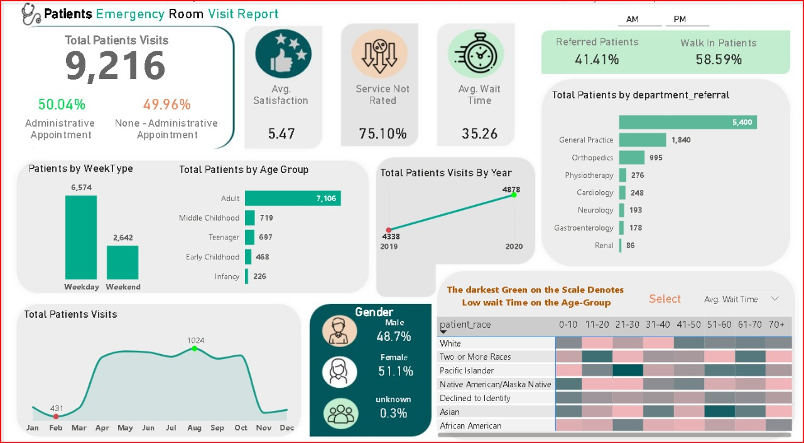

# Healthcare Emergency Room Analytics Dashboard

## Executive Summary
This Microsoft Power BI solution delivers comprehensive emergency department analytics designed to optimize operational efficiency, enhance patient experience, and facilitate evidence-based decision-making for healthcare administrators and clinical leadership teams.

## Dashboard Architecture & Core Metrics

### Primary Performance Indicators
| Metric | Value | Strategic Significance |
|--------|-------|------------------------|
| Total Patient Volume | 9,216 | Baseline capacity utilization metric |
| Average Wait Time | 35.26 minutes | Key patient experience determinant |
| Patient Satisfaction Index | 5.47/10 | Experience measurement benchmark |
| Service Documentation Rate | 24.90% | Compliance and data integrity indicator |

### Patient Flow Distribution
- **Appointment Classification**: 50.04% Administrative / 49.96% Non-Administrative
- **Entry Pathway Analysis**: 41.41% Department Referrals / 58.59% Direct Walk-In
- **Demographic Segmentation**: 48.7% Male / 51.1% Female / 0.3% Undocumented

### Temporal Analysis Framework
- **Weekday/Weekend Distribution**: 6,574 vs. 2,642 (71.3% vs. 28.7%)
- **Monthly Utilization Patterns**: Notable peak of 1,024 visits in July
- **Year-over-Year Trend**: 12.4% increase (4,338 in 2019 → 4,878 in 2020)

### Patient Demographic Stratification
- **Age Cohort Analysis**:
  - Adult: 7,106 (77.1%)
  - Middle Childhood: 719 (7.8%)
  - Adolescent: 697 (7.6%)
  - Early Childhood: 468 (5.1%)
  - Infant: 226 (2.5%)

- **Intersectional Analysis**: Heat map visualization of wait time distribution across age groups and racial demographics

### Clinical Pathway Utilization
- **Departmental Distribution**:
  | Department | Referral Volume | Percentage of Total |
  |------------|----------------|---------------------|
  | General Practice | 1,840 | 46.0% |
  | Orthopedics | 995 | 24.9% |
  | Physiotherapy | 276 | 6.9% |
  | Cardiology | 248 | 6.2% |
  | Neurology | 193 | 4.8% |
  | Gastroenterology | 178 | 4.5% |
  | Renal | 86 | 2.1% |
  | Other Specialties | 184 | 4.6% |

